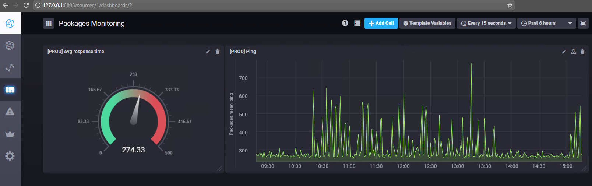

# ApiMonitor
Monitoring of web APIs using a simple go application.

The api checker is reading configuration info from checks.json, executing the checks specified in the file every 5 seconds and writing the execution times to an InfluxDb instance. Basically it collects performance of various endpoints over time.

# Configuration File Format
The configuration file is an array of "check" objects that roughly have the following shape:

```go
//Header defines a HTTP header to add to the request
type Header struct {
	Name  string
	Value string
}

//Check defines a check to be performed
type Check struct {
	Name       string
	Env        string
	APIName    string
	TargetURL  string
	HTTPMethod string
	Headers    []Header
	Body       string
}
```
This means that you could write JSON like the following to define a check:

```json
{
    "env": "TEST",
    "apiName": "MyAwesomeApi",
    "name": "ping",
    "targetUrl": "http://awesomeApi.man/_monitoring/ping",
    "httpMethod": "GET",
    "headers": [
        {
            "name": "Content-Type",
            "value": "text/xml; charset=utf-8"
        }
    ]
}
```
# Running the code
You download go from [golang.org](https://golang.org/dl), install it and in the src folder run the following commands:

```cmd
cd src

go build apiChecker.go

apiChecker.exe #if windows
./apiChecker #if not windows
```


# InfluxDb
The excution times for the checks are placed in an influx database. If you want to get up and running in no time just head over to the [InfluxDb Download Page](https://portal.influxdata.com/downloads). It will download a single exe, with everything in it, no installs no fancy setup. You run it and it works!

# Chronograf
To see the metrics you've been collecting you can go for fancy full fledged grafana thins or you can just download Chronograf, from the same page and look at your data. Just like for InfluxDb itself you will download a single exe, run it, works out of the box and it looks awesome too:


